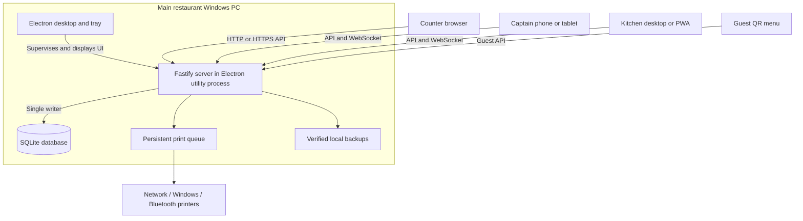

# ForkFlow — Application Overview

**Application version:** 0.6.4  
**Documented:** 5 October 2026  
**Scope:** The current source tree, including changes present in the workspace. This describes the implementation, not a certification of an installed executable or a new test run.

ForkFlow is a restaurant point-of-sale (POS) application for Windows. It manages menu items, tables, takeaway orders, kitchen order tickets (KOTs), GST billing, payments, inventory, reports, and local backups. One restaurant PC hosts the application server and database. Other counters, captains/waiters, kitchen displays, and guest phones connect to that PC over the restaurant network.

Ordinary restaurant operations work without internet while the main PC, local network, and applicable license remain operational. The current system is a single-outlet application. Hosted accounts, restaurant-data synchronization, and public online ordering are future work.

The main evidence for this guide is [package.json](package.json), the workspace manifests, [server composition](apps/server/src/server.ts), [UI entry point](apps/ui/src/App.tsx), the build scripts, and the operational documentation. [PROJECT_PLAN.md](PROJECT_PLAN.md) contains historical product ambitions; its earlier Next.js/PostgreSQL architecture does not describe the current runtime.

## Contents

1. [Application editions and interfaces](#1-application-editions-and-interfaces)
2. [Architecture and request flow](#2-architecture-and-request-flow)
3. [Repository structure](#3-repository-structure)
4. [Frameworks and dependencies](#4-frameworks-and-dependencies)
5. [Data model and storage](#5-data-model-and-storage)
6. [Features and workflows](#6-features-and-workflows)
7. [Roles, authentication, and licensing](#7-roles-authentication-and-licensing)
8. [API and real-time communication](#8-api-and-real-time-communication)
9. [Local development and configuration](#9-local-development-and-configuration)
10. [Build and deployment](#10-build-and-deployment)
11. [Backups, recovery, and operations](#11-backups-recovery-and-operations)
12. [Testing and verification](#12-testing-and-verification)
13. [Implementation boundaries and future work](#13-implementation-boundaries-and-future-work)
14. [Further documentation](#14-further-documentation)

## 1. Application editions and interfaces

| App or interface | Purpose | Runtime and connection |
| --- | --- | --- |
| **ForkFlow** | Licensed customer POS with fresh restaurant setup and Basic/Pro activation | Electron desktop app hosting Fastify, SQLite, and the built React UI; default HTTP port **4100** |
| **ForkFlow Demo** | Demonstrations with persistent, resettable sample restaurant data | Separate Electron app identity and data directory; default HTTP port **4110**; simulated thermal printing |
| **ForkFlow Kitchen** | Dedicated Windows kitchen display | Thin Electron client connecting to a main POS or Demo server; no independent POS database or server |
| **Counter browser** | Additional billing counter | Opens the main PC's address and uses the same API and database |
| **Captain App** | Phone/tablet interface for waiters and captains | React interface at `/captain/`; installable PWA with trusted HTTPS |
| **Kitchen browser/PWA** | Kitchen display on a tablet or browser | `/kitchen/`; installable with trusted HTTPS |
| **Guest menu** | Table menu browsing, order requests, and service calls | `/menu/#<table-token>` on the restaurant network; ordering/service calls depend on entitlement |

Customer and Demo builds share source but have separate installers and data. Demo activation does not turn it into a customer installation. The Kitchen client can connect to either edition using its address and port.

## 2. Architecture and request flow



### Main design decisions

- **One database authority:** Only the restaurant server opens SQLite. LAN clients perform operations through the API; they do not open a shared database file.
- **Desktop supervision:** Electron launches the server with `utilityProcess.fork`, checks its health and instance identity, captures logs, and retries crashes with bounded backoff. Closing the POS window hides it; quitting from the tray stops the server.
- **Shared web UI:** Fastify serves the Vite production build to Electron and browsers. During development, Vite serves the UI and proxies `/api`, including WebSockets, to Fastify.
- **Modular backend:** Feature modules register routes on one Fastify application. Shared domain code contains schemas, database migrations, and business rules.
- **Server-side decisions:** Permissions, licensing, order state, bill calculation, inventory deductions, and request validation are enforced by the server.
- **Live updates:** Authenticated WebSockets announce changes. Screens refresh their saved state from the API.
- **Retryable writes:** Selected order and billing requests are persisted in browser storage with stable references before transmission. The server can recognize retries without duplicating the business operation.
- **Local PWA caching:** Captain and Kitchen service workers cache the application interface and static assets. They do not cache API responses or independently execute restaurant transactions offline.

### Example: dine-in order to settled bill

1. Staff open a table and create or select a customer bill group.
2. Menu selections are saved as order items. The selected service prices are captured for the order items.
3. Sending kitchen items creates station-specific KOTs, records applicable stock consumption, and queues configured print copies.
4. Kitchen staff accept active tickets. Unless an administrator has turned the setting off, dine-in bill preview/issue remains blocked until the required tickets are accepted; completion with **Done** can happen afterward.
5. The cashier previews GST and discounts, then issues a bill containing saved financial and restaurant details.
6. Staff record cash, UPI, and/or card amounts and settle the bill. The total payment must equal the bill total.
7. A table becomes available when all its bill groups have finished. Receipts and reports use the saved billing records.

Key files: [desktop lifecycle](apps/desktop/src/main.ts), [server startup](apps/server/src/main.ts), [server composition](apps/server/src/server.ts), and [browser retry queue](apps/ui/src/retry-queue.ts).

## 3. Repository structure

The repository is a private **npm workspaces monorepo**, with `apps/*` and `packages/*` declared as workspaces.

```text
Restaurant Billing Software/
├── apps/
│   ├── desktop/                 Main POS and Demo Electron shell
│   │   └── src/                 Server supervision, tray, restore, demo reset
│   ├── kitchen-desktop/         Separate Electron kitchen client
│   │   └── src/                 Connection screen, preload bridge, window lifecycle
│   ├── server/                  Fastify API and local application services
│   │   └── src/
│   │       ├── server.ts         Application composition and route registration
│   │       ├── main.ts           Database, backups, static hosting, listeners
│   │       ├── print/            ESC/POS rendering, printer transports, queue
│   │       └── *.ts              Feature routes, services, and colocated tests
│   └── ui/                      React application built with Vite
│       ├── src/screens/          POS, kitchen, guest, reports, and settings screens
│       ├── src/                  Navigation, API, charts, retry queue, CSS, helpers
│       ├── public/               PWA manifests, icons, and static assets
│       └── *pwa-plugin.ts        Captain and Kitchen build-time PWA support
├── packages/
│   ├── core/src/                PIN hashing, permission checks, signature verification
│   └── domain/src/              SQLite access, schemas, business calculations
│       └── migrations/          Ordered schema migrations 001 through 025
├── tools/
│   ├── build-desktop.mjs         Stage development, Demo, or commercial desktop app
│   ├── build-kitchen.mjs         Stage the Kitchen client
│   ├── desktop-build-config.mjs  Edition and public-key validation
│   ├── verify-desktop-package.mjs Installer staging checks
│   ├── issue-license.ts         Operator-only license signing helper
│   ├── setup-captain-https.ps1   Local restaurant HTTPS certificate setup
│   ├── installer*.nsh           Windows installer firewall hooks
│   └── e2e/                    Disposable fixtures and browser/runtime checks
├── docs/
│   ├── operations/              Feature setup and operating guides
│   ├── agents/handoff/          Historical implementation handoffs
│   ├── superpowers/             Design specifications and milestone plans
│   └── screenshots/             Documentation images
├── spikes/menu-ingestion/       Separate experimental AI menu-import project
├── build/desktop/               Generated app, commercial, demo, and kitchen stages
├── dist/                        Generated installers and unpacked distributions
├── output/                      Verification output and screenshots
├── .e2e-scratch/                Disposable verification data
├── electron-builder*.yml        Windows distribution configuration
├── Start ForkFlow*.cmd          Workspace launchers for staged Electron apps
├── package.json                 Root scripts and workspace configuration
├── package-lock.json            Resolved dependency lockfile
├── tsconfig*.json               Shared/root TypeScript configuration
├── vitest.config.ts             Unit and integration test configuration
├── README.md                    Project introduction and current operations
└── PROJECT_PLAN.md              Historical product vision
```

### Module responsibilities

| Workspace | Package name | Responsibility |
| --- | --- | --- |
| `apps/desktop` | `@forkflow/desktop` | Main Windows lifecycle, server process, tray, recovery, Demo behavior |
| `apps/kitchen-desktop` | `@forkflow/kitchen-desktop` | Connect a dedicated kitchen window to an existing restaurant server |
| `apps/server` | `@forkflow/server` | REST API, authentication, live events, printing, backups, and integration adapters |
| `apps/ui` | `@forkflow/ui` | Staff POS, Captain, Kitchen, guest menu, reports, and settings |
| `packages/core` | `@forkflow/core` | Reusable authentication, RBAC, and Ed25519 verification primitives |
| `packages/domain` | `@forkflow/domain` | SQLite schema/migrations, validation, billing, inventory, reporting, and licensing rules |

## 4. Frameworks and dependencies

The following versions are **declared package.json ranges**, not a claim that every installed module has the range's minimum version. `package-lock.json` records the resolved versions used by `npm ci`.

### Application stack

| Technology / package | Declared version or target | Use |
| --- | --- | --- |
| Node.js | Documented development baseline: **24+**; desktop bundles target `node24` | Server runtime and development tooling; Electron supplies the packaged runtime |
| TypeScript | `^5.7.2` | Strict typing across server, domain, Electron, and UI |
| Electron | `^43.4.0`; installer configurations pin `43.4.0` | Main Windows POS/Demo shell and Kitchen client |
| React | `^19.2.8` | Component-based UI |
| React DOM | `^19.2.8` | Browser rendering |
| Vite | `^8.2.1` | UI development server and production asset build |
| `@vitejs/plugin-react` | `^6.0.5` | React integration with Vite |
| Fastify | `^5.11.3` | HTTP API server |
| `@fastify/static` | `^10.1.3` | Serve built UI and static files |
| `@fastify/websocket` | `^11.3.0` | Live staff event connection |
| `better-sqlite3` | `^13.0.3` | Native SQLite driver |
| Zod | `^4.4.3` | Runtime request and domain schema validation |
| `proper-lockfile` | `^4.1.2` | Data-directory locking fallback outside Windows |
| `qrcode` | `^1.5.4` | Generate connection, table-menu, and UPI QR codes |

The frontend uses React hooks, application-managed page state, native `fetch`, custom components, and CSS. Core staff navigation is implemented in [App.tsx](apps/ui/src/App.tsx) and [NavBar.tsx](apps/ui/src/NavBar.tsx); the package manifests do not declare a separate routing, global state, UI component, or charting library. Financial persistence uses explicit SQL and domain functions rather than an ORM.

Shared TypeScript options include strict checking, `noUncheckedIndexedAccess`, `exactOptionalPropertyTypes`, and an ES2023 target. Backend modules use NodeNext resolution; the UI has its own browser-oriented TypeScript configuration.

### Build and test dependencies

| Package | Declared version | Use |
| --- | --- | --- |
| `electron-builder` | `^26.15.3` | Windows NSIS installers and unpacked distributions |
| `esbuild` | `^0.28.2` | Bundle Electron and server entry points |
| `tsx` | `^4.19.2` | Run TypeScript source and fixture scripts |
| `concurrently` | `^10.0.4` | Run server and UI development processes together |
| `vitest` | `^4.1.10` | Unit and integration tests |
| `jsqr` | `^1.4.0` | QR decoding in verification |
| `@types/node` | `^22.10.2` | Node API type definitions; independent of the runtime baseline |
| `@types/proper-lockfile` | `^4.1.4` | Lockfile type definitions |
| `@types/qrcode` | `^1.5.6` | QR generator type definitions |
| `@types/better-sqlite3` | `^9.6.0` | SQLite driver type definitions |
| `@types/react` | `^19.2.18` | React type definitions |
| `@types/react-dom` | `^19.2.4` | React DOM type definitions |

The server also declares local `@forkflow/core` and `@forkflow/domain` workspace dependencies using `*`.

### Experimental dependency

[spikes/menu-ingestion](spikes/menu-ingestion/README.md) is a separate project with its own manifest and lockfile. It declares `@anthropic-ai/sdk` at `^0.110.0`, plus `tsx`, TypeScript, and Node types. It explores extracting a structured menu from images/PDFs. It is outside the root workspace globs and is not part of the shipped POS menu-import workflow.

## 5. Data model and storage

### SQLite configuration

[openDb](packages/domain/src/db.ts) enables write-ahead logging (`WAL`), foreign keys, a 5-second busy timeout, and `synchronous=NORMAL`. The server holds an exclusive data-directory lock. Windows uses an exclusive named pipe derived from the resolved directory; other platforms use `proper-lockfile`.

[Migrations](packages/domain/src/migrations/index.ts) currently run from **001 through 025**. Startup checks the schema version, creates a required backup before upgrading an existing database, and applies pending migrations. A database with a schema newer than the application is rejected.

### Main table groups

| Area | Principal tables |
| --- | --- |
| Staff and settings | `users`, `sessions`, `settings` (includes the tax mode, UPI ID and kitchen-acceptance billing setting) |
| Catalog | `categories`, `products`, `variants` |
| Tables and reservations | `dining_tables`, `reservations`, `table_links`, `order_table_events` |
| Orders and kitchen | `orders`, `order_items`, `kots`, `kot_requests` |
| Billing and payments | `bills`, `bill_taxes`, `payments`, `bill_settlements`, `bill_report_lines`, `credit_notes`, `credit_note_lines`, `credit_note_taxes`, `refund_payments`, `sequences` |
| Inventory | `stock_items`, `product_stock_links`, `stock_moves`, `stock_cost_changes` |
| Printing | `printers`, `kot_stations`, `print_jobs`, `print_queue_state` |
| Guest interactions | `table_qr`, `guest_requests`, `guest_service_requests` |
| Licensing | `license_state`, `licensed_devices`, `license_events` |
| Zomato ledger | `zomato_settings`, `zomato_orders`, `zomato_events`, `zomato_settlements`, `zomato_imports` |

Orders connect to tables where applicable, and contain order items and KOTs. Bills preserve issued financial details, with separate taxes, settlement records, payments, and reporting lines. Voids and refunds are append-only credit notes (with their own lines, taxes, and refund payments) that never edit the bill. Product recipes use stock links; stock movements preserve consumption and cancellation reversal history, including the cost value each movement carried. Products also store uploaded menu photos in the database, so ordinary database backups include them.

### Financial and stock rules

- Money calculations use **integer paise**. Exports and display formatting convert amounts to rupees.
- GST supports tax-exclusive and tax-inclusive menu pricing. Discounts are allocated across applicable rates, CGST/SGST round to paise, and the final payable rounds to the nearest rupee.
- Bills preserve the applicable restaurant details, tax mode, item values, and reporting data. Later catalog changes do not reprice issued bills.
- Stock quantities support three decimal places. Units are fixed after stock-item creation.
- Stock consumption occurs when kitchen items are sent, or at bill issue for products without a kitchen station. Settlement and reprinting do not consume stock again.
- Cancelling consumed items reverses their recorded quantities, even if the recipe was changed later.

### Storage locations

| Execution mode / item | Default location |
| --- | --- |
| Source server (`npm run dev:server`) | `<repository>/data/forkflow.db`, unless `FORKFLOW_DATA_DIR` is set |
| Main desktop/customer app | Electron `userData/data`; normally `%APPDATA%\forkflow-desktop\data` |
| Demo | `%APPDATA%\forkflow-demo\data` |
| Kitchen client connection | `%APPDATA%\forkflow-kitchen\connection.json` |
| Local backups | `backups/` within the active server data directory |
| Recovery archives | `recovery/` within the active data directory |
| Desktop server logs | `server.log` and rotated `server.log.previous` in the data directory |
| Browser state | Origin-specific localStorage: sessions, device credential, drafts, retry queue, preferences |

The desktop tray's **Open data and backups** command identifies the actual directory. Running the desktop shell from the workspace still uses Electron's data-directory logic unless explicitly overridden; do not assume it uses the source server's `./data` directory.

Licensing installation identity, backup preferences, cloud queue metadata, and HTTPS configuration/certificates include files outside SQLite. A database snapshot is not a complete backup of these installation-level files or browser drafts.

## 6. Features and workflows

### Restaurant setup and staff

- First-run restaurant and administrator setup.
- Unique staff PINs, active/inactive users, and fixed administrator, cashier, waiter, and kitchen roles.
- Restaurant profile and GST settings, UPI payment details, printer configuration, device licensing, backups, and connection information.
- Responsive layouts, light/dark themes, and configurable keyboard shortcuts for common POS actions.

### Catalog and service pricing

- Categories, menu products, portions/variants, GST rates, and kitchen station assignments.
- Descriptions and uploaded dish photos for staff and guest menus.
- Active/inactive and sold-out controls enforced when adding new items.
- Separate Non-AC, AC, and takeaway prices for items and variants. Blank service prices fall back to the normal item/variant price.
- Administrator CSV template, export, import preview, and validated import for products and variants.

### Tables, orders, and reservations

- Dine-in tables and parcel/takeaway orders.
- Multiple independent customer bill groups at one table, each with its own order and bill.
- Moving an open order to a free table and merging two open dine-in orders (different tables or two bill groups) into one bill; the second table stays linked and occupied until payment.
- Searchable menu selection, variants, quantities, cooking notes, saved cart state, and item/order cancellation.
- Captain selection on each open dine-in customer order. A new visit or split does not inherit a fixed table captain.
- Table status and service overview, with links to open groups and guest requests.
- Reservations with guest details, time ranges, conflict checks, status changes, and seating into an order.

### Kitchen and printing

- Station-specific KOT creation, kitchen acceptance, completion, and live updates.
- Dine-in billing gate until all required active KOTs are accepted, controlled by an administrator setting (on by default) for restaurants that only print KOTs.
- Dedicated Windows Kitchen client, browser display, and Kitchen PWA.
- Network thermal printing, installed Windows printer queues, and paired Bluetooth COM-port printing.
- ESC/POS output for 58 mm and 80 mm paper, station routing, and cancellation tickets.
- Separate bill and KOT profiles for copies, feed lines, and cutter behavior.
- Persistent per-copy print jobs, retry, and explicit review of uncertain physical output.
- Browser receipt view with A4 print/save-to-PDF support.

Bills, KOTs and cancellations save their print jobs in the same transaction as the business change, but a slip that cannot be rendered (for example a damaged printer profile) does not block the sale: the response reports it and no job is created. Windows and Bluetooth failures that provably happened before data reached the printer are plain failures; later or uncertain ones need a paper check. Failed and uncertain jobs are capped at the newest 200.

Printer submission success means the transport/spooler accepted the bytes; it does not prove that paper physically printed. Intended USB, network, Bluetooth, feed, and cutter behavior still requires hardware verification.

### Billing, takeaway, and UPI

- Bill preview and issue, inclusive/exclusive GST, reasoned discounts, rounding, and saved bill snapshots.
- Cash, UPI, card, and split-payment settlement; cashier discount cap of 10%.
- Unpaid/paid bill history, receipt reprints, and independent bills for table groups.
- **Quick takeaway** for cashiers/admins: cart, kitchen send, bill issue, received payment, cash change, receipt options, and interrupted-checkout recovery.
- UPI QR codes generated locally with the configured restaurant UPI ID and final payable amount on eligible unpaid bills.
- Staff verify UPI receipt in the bank/payment app before recording settlement. There is no automatic payment-gateway confirmation.
- **Voids and refunds** for administrators and cashiers (`bills.refund`): a whole bill (paid or unpaid) can be voided and chosen items on a paid bill refunded by item and quantity. Each action creates a numbered, dated credit note (CN-n); the original bill is never edited, except that a void marks it VOID. Credit amounts come from the bill's stored item lines (discount, GST, and round-off), so credit notes always sum exactly to the bill. Cashiers need an active administrator's PIN ("Admin approval"; wrong PINs lock out after five tries, counted separately from login) while administrators approve themselves. Staff choose refund methods, never more than was paid per method. An unpaid void cancels the order and frees the table and any linked tables. Stock is not restored. Older bills without stored item lines can only be voided. Credit notes print or open as a slip (`credit_note` print kind). See [Refunds and voids](docs/operations/refunds-and-voids.md).

### Inventory and recipes

- Stock items with `pcs`, `kg`, `g`, `L`, and `ml` units, opening balances, low-stock thresholds, and movement history.
- Stock receipts/purchases, wastage, and count adjustments through stock movements.
- Basic single-ingredient product links and Pro administrator editing of multi-ingredient recipes.
- Recipe quantity conversion between kg/g and L/ml, inline stock creation, precision checks, and concurrent-edit protection.
- Recipes apply to every variant of a product.
- Existing recipes continue consuming stock after a Pro-to-Basic downgrade; multi-ingredient editing becomes unavailable.
- Low stock is a warning. Recipe linkage does not automatically prevent orders that take stock below zero.
- Inventory costing (administrators on Pro, `costs.read` permission and the `recipes` entitlement): weighted-average unit cost per stock item, set by priced purchases (amount paid including GST) or an explicit unit-cost entry; cost frozen on every new stock movement; stock value; dish costing against each price; and a date-range food cost and profit report with CSV export. Sales with unknown cost or no recipe are reported separately, never as zero cost. See [Inventory costing](docs/operations/costing.md).

### Reports and analytics

- Dashboard sales and cash/UPI/card collection charts.
- Date-filtered sales, collections, and day-end/GST reports with CSV export.
- Item/category sales, cashier collections, hourly sales, KOT performance, cancellations, and stock consumption/wastage reports.
- Order analytics comparing takeaway and dine-in, item rankings, category performance, daily trends, and busy hours.
- Issued-sales reporting uses bill issue dates, including eligible unpaid bills and void bills (voids stay in their issue day's gross sales). Credit notes are subtracted on their own date; day-end shows a credit-notes block, net figures, and net GST per rate, the sales report adds Credit notes and Net sales columns, and a Credit notes detailed report exports CSV. Collection reporting uses payment dates and can include payments against older bills.
- Date boundaries use the **server's local timezone**; supported range reports generally limit requests to 366 days.
- Exports use the displayed report snapshot and include relevant dates, timezone, and calculation notes.

### Guest QR and service requests

- Administrator-managed table QR links with enable, disable, and replacement controls.
- Basic menu browsing; Pro guest order requests and waiter/bill service calls.
- Staff accept a guest request into an explicitly selected bill group, or reject it with a reason.
- Acceptance creates pending order items; staff still review/send them to the kitchen and follow normal billing.
- Guest-specific request/preparation tracking and further ordering while earlier requests are in progress.
- Staff notifications and handled status for service calls. A request for the bill does not issue or settle a bill automatically.
- Guest phones do not consume staff device registrations.

### Zomato setup and reconciliation

- Save restaurant connection metadata and import order history/settlement CSVs using ForkFlow templates.
- Preview and atomic import, duplicate detection, immutable conflicting-ID handling, and import history.
- Separate ledger with missing-order, awaiting-statement, matched, amount-mismatch, and cancellation-review outcomes.
- Search/date/status review and CSV exports.
- Imported records do not create POS bills, payments, KOTs, or stock movements and do not inflate local sales reports.
- Live Zomato receiving and accept/reject/ready actions remain inactive pending an approved, verified provider integration.

## 7. Roles, authentication, and licensing

### Staff permissions

| Role | Main permissions |
| --- | --- |
| **Admin** | All application permissions; staff, catalog, tables, printers, configuration, inventory editing, licensing, backups, and reports |
| **Cashier** | Orders, KOTs, billing/settlement, reservations, catalog/table/stock reading, reports, and Zomato reading/import; discount cap 10% |
| **Captain / waiter** | Create/read/update orders, create/read KOTs, read tables/catalog/reservations, review eligible guest requests; waiter login enters Captain |
| **Kitchen** | Read/update KOTs; kitchen acceptance and completion |

The fixed permission vocabulary and limits are defined in [roles.ts](packages/domain/src/roles.ts); endpoint handlers enforce them. Roles and commercial feature entitlements are separate checks.

Staff sign in with unique 4–6 digit PINs. PIN hashes use Node's `scrypt` with random salts and constant-time comparison. Server-side session records hold random bearer tokens with a 24-hour lifetime. Failed PIN attempts trigger per-IP backoff. The UI sends a browser device credential with API requests; licensed sessions are checked against device registrations. Kitchen keeps a separate session-token storage key on the same origin.

The Electron renderer uses `nodeIntegration: false`, `contextIsolation: true`, and `sandbox: true`. The deployment model is a trusted restaurant LAN; public multi-tenant authentication and internet-facing hosting are separate future work.

### Commercial entitlements

| Capability | Basic | Pro |
| --- | --- | --- |
| Registered staff browser/device slots | 2 | 5 |
| POS billing, basic inventory, local backups | Included | Included |
| Single-ingredient stock linking | Administrator editing | Administrator editing |
| Multi-ingredient recipe editing | Existing recipes viewable; editing restricted | Administrator editing |
| Guest QR menu browsing | Included | Included |
| Guest ordering and service calls | Unavailable | Included when signed `qrOrdering` entitlement is enabled |

Registrations are browser-profile/origin credentials rather than hardware fingerprints. The main POS, additional counter browsers, Captain devices, and Kitchen displays use staff slots. Multiple tabs in one profile/origin share the credential; changing origin or clearing storage can require registration again.

Licenses are signed Ed25519 grants scoped to organization, outlet, installation, revision, dates, and entitlements. The app supports activation-request export, license-file preview/import, device management, and change history. Commercial builds embed only the public verification key. [tools/issue-license.ts](tools/issue-license.ts) is an operator-only signing helper, excluded from the desktop bundle; the private signing key belongs outside the application and repository.

Development and Demo builds allow their intended local/demo behavior without customer activation. Commercial installation identity must be preserved during updates and same-PC recovery. Database-only transfer to another installation still needs a provider-managed re-enrollment process.

## 8. API and real-time communication

The backend exposes JSON REST endpoints under `/api`. The table below maps route families to implementations; individual methods, bodies, permissions, and state checks are defined in those files and their Zod schemas.

| Area | Representative routes | Implementation |
| --- | --- | --- |
| Health and setup | `/api/health`, `/api/needs-setup`, `/api/setup` | [server.ts](apps/server/src/server.ts), [auth.ts](apps/server/src/auth.ts) |
| Sessions and staff | `/api/login`, `/api/logout`, `/api/me`, `/api/users` | [auth.ts](apps/server/src/auth.ts), [users.ts](apps/server/src/users.ts) |
| Catalog | `/api/categories`, `/api/products`, `/api/variants/:id`, `/api/kot-stations` | [catalog.ts](apps/server/src/catalog.ts) |
| Menu transfer | `/api/catalog/export`, `/api/catalog/import/preview`, `/api/catalog/import` | [catalog-transfer.ts](apps/server/src/catalog-transfer.ts) |
| Tables/reservations | `/api/tables`, `/api/reservations`, `/api/reservations/:id/seat` | [tables.ts](apps/server/src/tables.ts), [reservations.ts](apps/server/src/reservations.ts) |
| Orders/captains | `/api/orders`, `/api/orders/:id/items`, `/api/order-items/:id`, `/api/captains` | [orders.ts](apps/server/src/orders.ts) |
| Table move/merge | `/api/orders/:id/move`, `/api/orders/:id/merge` | [table-transfer.ts](apps/server/src/table-transfer.ts) |
| Kitchen | `/api/orders/:id/send`, `/api/kots`, `/api/kots/:id/accept`, `/api/kots/:id/done` | [kots.ts](apps/server/src/kots.ts) |
| Billing | `/api/orders/:id/bill-preview`, `/api/orders/:id/bill`, `/api/bills/:id/settle` | [billing.ts](apps/server/src/billing.ts) |
| Receipts/pay QR | `/api/bills/:id/receipt`, `/api/bills/:id/print`, `/api/bills/:id/upi-qr` | [billing.ts](apps/server/src/billing.ts) |
| Voids/refunds | `/api/bills/:id/credit-preview`, `/api/bills/:id/void`, `/api/bills/:id/refund`, `/api/credit-notes/:id/receipt`, `/api/credit-notes/:id/print` | [credit-notes.ts](apps/server/src/credit-notes.ts) |
| Reports | `/api/reports/day-end`, `/api/reports/sales`, `/api/reports/operations/:kind`, `/api/reports/analytics` | [reports.ts](apps/server/src/reports.ts), [sales-reports.ts](apps/server/src/sales-reports.ts), [operational-reports.ts](apps/server/src/operational-reports.ts), [order-analytics.ts](apps/server/src/order-analytics.ts) |
| Stock/recipes | `/api/stock-items`, `/api/stock-items/:id/movements`, `/api/products/:id/stock-links`, `/api/products/:id/recipe` | [stock.ts](apps/server/src/stock.ts) |
| Costing | `/api/stock-items/:id/unit-cost`, `/api/costing/stock`, `/api/costing/dishes`, `/api/reports/profit` | [costing.ts](apps/server/src/costing.ts) |
| Guest/staff QR | `/api/guest/menu`, `/api/guest/requests`, `/api/qr/tables`, `/api/qr/requests` | [guest-ordering.ts](apps/server/src/guest-ordering.ts) |
| Guest service calls | `/api/guest/service-requests`, `/api/qr/service-requests` | [guest-services.ts](apps/server/src/guest-services.ts) |
| Printers | `/api/printers`, `/api/printers/discover`, `/api/print-jobs` | [printers.ts](apps/server/src/printers.ts) |
| Settings/system | `/api/settings`, `/api/system/connections`, `/api/system/generation`, `/api/system/backups` | [settings.ts](apps/server/src/settings.ts), [system.ts](apps/server/src/system.ts) |
| Licensing | `/api/license`, `/api/license/preview`, `/api/license/devices`, `/api/license/history` | [licensing.ts](apps/server/src/licensing.ts) |
| Cloud backup framework | `/api/system/cloud-backups` and upload/retry/disconnect actions | [cloud-backups.ts](apps/server/src/cloud-backups.ts), [system.ts](apps/server/src/system.ts) |
| Zomato | `/api/zomato/settings`, `/api/zomato/orders`, `/api/zomato/reconciliation`, `/api/zomato/import/:action` | [zomato.ts](apps/server/src/zomato.ts) |
| Live events | `/api/ws` | [ws.ts](apps/server/src/ws.ts) |

Staff WebSockets authenticate through an initial frame, with a default five-second authentication deadline. Sessions and license/device access are revalidated every 60 seconds and immediately on logout, user changes and license/device changes, not on every broadcast. Browser writes use HTTP; subsequent client WebSocket frames do not perform business mutations.

## 9. Local development and configuration

### Prerequisites and startup

Use Node.js 24+ and npm, with Windows x64 for the supported desktop packaging workflow. Customer installations receive the runtime and do not need these tools.

From the repository root:

```powershell
npm ci
npm run typecheck
npm test

# Choose a separate development database before starting the source server.
$env:FORKFLOW_DATA_DIR = Join-Path $PWD '.e2e-scratch\development'
npm run dev
```

`npm run dev` starts Fastify on **4100** and Vite on **5173**. Open `http://localhost:5173`. The Vite proxy currently targets `http://localhost:4100`; changing only the server port does not update that proxy. Ensure the port is free or deliberately configure a separate development setup before starting alongside an installed POS.

For the Electron development workflow, run `npm run dev:desktop`. It builds the UI and desktop stage, then opens `build/desktop/app` with Electron. The environment's `FORKFLOW_DATA_DIR` override also applies to this non-Demo desktop launch.

The repository documents a Windows/npm installation fallback when SQLite installation scripts fail despite a usable bundled native binary:

```powershell
npm ci --ignore-scripts
node node_modules/electron/install.js
```

This is a troubleshooting fallback: skipping scripts also skips Electron's normal runtime download, so the explicit install step is needed for desktop use. Confirm the native dependency works with the project's checks afterward.

### Configuration variables and files

| Setting | Purpose / default |
| --- | --- |
| `FORKFLOW_DATA_DIR` | Override the source server/non-Demo desktop data directory |
| `FORKFLOW_PORT` | HTTP port, default 4100; Demo desktop explicitly uses 4110 |
| `FORKFLOW_UI_DIR` | Built UI directory served by the backend; desktop supplies its staged `ui` directory |
| `FORKFLOW_LICENSE_PUBLIC_KEY` | Ed25519 public SPKI PEM for commercial builds; also enables enforcement when running unbundled server source |
| `FORKFLOW_BUILD_STAGE` | Optional internal development stage under `build/desktop`; commercial/Demo builds enforce their dedicated stage names |
| `FORKFLOW_DISABLE_AUTOSTART=1` | Suppress automatic first-launch Windows login registration in the packaged main app |
| `FORKFLOW_RESTORE` | One-launch source recovery snapshot path; remove after the recovery launch |
| `FORKFLOW_APP_VERSION` | Server version metadata for startup/backup handling; supplied by desktop |
| `FORKFLOW_INSTANCE_ID` | Health identity used by desktop supervision; supplied by desktop |
| `captain-https.json` | Optional HTTPS settings inside the active data directory, referencing local certificate/passphrase files |

The shown server entry point reads process environment variables directly; it does not automatically load a `.env` file. Packaged commercial licensing uses the embedded key, so removing an environment variable does not disable it. Ordinary bundled development and Demo builds do not become commercial builds from an ambient release key.

## 10. Build and deployment

### Build commands

| Command | Result |
| --- | --- |
| `npm run build -w @forkflow/ui` | Build browser assets into `apps/ui/dist` |
| `npm run build:desktop` | Build UI and stage internal development app at `build/desktop/app` |
| `npm run build:demo` | Validate Demo configuration, build UI, stage `build/desktop/demo` |
| `npm run build:commercial` | Validate public key, build UI, stage licensed `build/desktop/commercial` |
| `npm run build:kitchen` | Stage the Kitchen client at `build/desktop/kitchen` |
| `npm run package:demo` | Windows x64 Demo NSIS installer |
| `npm run package:commercial` | Windows x64 customer NSIS installer |
| `npm run package:win` | Alias for commercial packaging |
| `npm run package:kitchen` | Windows x64 Kitchen NSIS installer |
| `npm run package:dir` | Unpacked licensed customer app, with the same key requirement |

The desktop builder bundles the server and Electron entry point with esbuild, copies the built UI, and copies production dependencies from the installed lockfile-based tree. Electron Builder packages the stage with ASAR and unpacks the native SQLite dependency. `npmRebuild` is disabled. Edition, version, and public-key fingerprint checks guard customer/Demo packaging.

Kitchen packaging references `build/desktop/icon.ico`, which is generated by the main desktop builder. On a clean checkout, build a main/Demo edition before packaging Kitchen so the icon exists.

### Customer package example

```powershell
# Use the public verification key from the license operator.
$env:FORKFLOW_LICENSE_PUBLIC_KEY = Get-Content 'C:\secure\license-public.pem' -Raw
npm run package:commercial
```

The path above is an example and must point to the operator's actual public key. Do not supply the private signing key. Close processes using the target build stage before rebuilding it.

### Distribution outputs for version 0.6.4

| Edition | App ID | Installer |
| --- | --- | --- |
| Customer | `in.forkflow.pos` | `dist/commercial/ForkFlow-Setup-0.6.4.exe` |
| Demo | `in.forkflow.demo` | `dist/demo/ForkFlow-Demo-Setup-0.6.4.exe` |
| Kitchen | `in.forkflow.kitchen` | `dist/kitchen/ForkFlow-Kitchen-Setup-0.6.4.exe` |

Customer and Demo installers use per-machine installation with a selectable directory. Kitchen is per-user. Installers create desktop shortcuts and retain application data on uninstall. Main/Demo packages include the UI, server, Electron runtime, and SQLite driver; they do not include the restaurant's live database.

### Restaurant installation sequence

1. Install the customer app on the designated Windows main PC. First-run packaging tools need internet on the build PC; ordinary installed POS operation is local.
2. Open ForkFlow, create the restaurant/admin, import the signed license, and register the device.
3. Configure staff, menu, prices/taxes, tables, kitchen stations, printers, and stock links/recipes.
4. Reserve the main PC's LAN address in the router. The customer installer adds a TCP **4100** firewall rule scoped to a private network and local subnet; Demo uses **4110**. Port overrides require corresponding network configuration.
5. Connect counters through the main PC's LAN URL. Use `/captain/` for staff tablets and `/kitchen/` for kitchen browsers, or enter the server URL in ForkFlow Kitchen.
6. Test the complete order → KOT → acceptance → bill → payment → receipt workflow on the intended devices and printers.
7. Configure backup retention and a second backup folder, then verify a restore procedure before relying on the installation operationally.

Closing the main window leaves ForkFlow in the tray. The customer desktop enables Windows login autostart on first packaged launch unless suppressed; the tray can toggle it. The primary PC must remain running for other devices to work.

### Optional local HTTPS and PWA installation

From the repository on the main PC, configure the real restaurant IP address:

```powershell
.\tools\setup-captain-https.ps1 -ServerAddress 192.168.1.20
```

Replace the example IP. The script defaults to the customer data directory and HTTPS port **4443**; pass the actual `-DataDirectory` for another installation. Restart the app, configure private-network firewall access for the HTTPS port, and trust the public restaurant CA certificate on staff devices. Then open `https://<server-ip>:4443/captain/` or `/kitchen/` and install through the browser's supported flow.

HTTPS forwards requests and WebSocket upgrades to the same Fastify handlers and database. It does not create a second POS server. Certificate warnings must be resolved for PWA installation. Detailed Android, iPad, firewall, and renewal steps are in [Captain setup](docs/operations/captain-app.md).

### Deployment status

The repository contains Windows installer workflows and manual build/verification tools. It has no checked-in Docker deployment, hosted web deployment configuration, or GitHub Actions pipeline. The documented Windows installer is currently unsigned; clean-machine installation, firewall reachability, login autostart, device trust, and physical printing remain deployment validation tasks.

## 11. Backups, recovery, and operations

### Local backup policy

- Daily snapshot at startup, with an hourly check using the server's local calendar date.
- Manual backups and administrator downloads.
- Mandatory pre-update snapshots before changing an existing schema or app version.
- Default daily retention of 30 days, configurable from 7 to 365; ten manual and ten pre-update snapshots retained separately.
- Optional second-folder copy, such as a removable disk or configured local/synced folder.
- SQLite `VACUUM INTO`, integrity/reference validation, disk flush, and rename from a partial file to a completed snapshot.

Use the app's backup operation instead of copying only the live `forkflow.db`; committed data may also be in WAL. Backup creation can briefly pause requests. A failed secondary copy does not invalidate a successful local snapshot.

### Restore and reconnection

Restore is initiated from the main desktop tray or startup error dialog. The server stops, verifies and stages the selected snapshot, archives current database/WAL files, installs the snapshot, invalidates old sessions, and restarts. A recovery journal supports interrupted restores. Recovery archives are retained for review.

Each restored database generation prevents old browser drafts and queued actions from replaying into the recovered data. Staff sign in again and review open orders, bills, payments, and stock before resuming.

The browser retry queue covers saved order items, kitchen send, bill issue, and settlement. It is tied to the originating staff user and browser storage. Closing the browser pauses retries. Administrative changes and creating a new server order require a live connection; a disconnected Captain device cannot confirm a KOT or printer result.

### Google Drive framework

Version 0.6.4 includes saved preferences, persistent queue metadata, a worker with retry/backoff, and an injectable provider contract. The shipping entry point supplies **no Google provider**. OAuth/account linking, credential protection, Drive networking, and cloud restore are unfinished. Settings show **Not configured**, and entering credentials alone would not enable uploads. Local backups work independently. A failed save of upload progress is retried automatically; unreadable cloud metadata keeps cloud backup off until restart.

Operational details: [Backups and recovery](docs/operations/backup-and-recovery.md) and [Google Drive framework](docs/operations/google-drive-backups.md).

## 12. Testing and verification

### Available checks

```powershell
npm test
npm run test:watch
npm run typecheck
npm run test:packaging
npm run build -w @forkflow/ui
```

- **Vitest:** Colocated `*.test.ts` files in application and package source directories. Coverage includes domain calculations, migrations, API behavior, role enforcement, billing, KOTs, stock, printing, recovery, licensing, guest interactions, reporting, and integration frameworks.
- **TypeScript:** Root server/shared/Electron checks plus the UI workspace's separate typecheck.
- **Node test runner:** Edition separation and desktop packaging guards through `tools/desktop-packaging.test.mjs`.
- **Browser/flow checks:** `tools/e2e` contains disposable servers, browser scripts, and scenario instructions for user flows, exports, errors, reconnects, role restrictions, and layouts.
- **Distribution checks:** A separate compiled-server smoke tool exercises Demo and customer setup/activation with scratch data. See the distribution operations guide for its signing-key requirements.

Browser fixtures use disposable databases and, where appropriate, fake print sinks or provider adapters. Some browser scripts intentionally create orders or alter fixture state, so follow [tools/e2e/README.md](tools/e2e/README.md) and use the matching fixture rather than a live restaurant.

This overview records what checks exist. Historical test counts in handoff documents apply to those earlier runs; no new application test/build result is asserted by this documentation update.

## 13. Implementation boundaries and future work

| Area | Current state | Remaining scope |
| --- | --- | --- |
| Windows restaurant POS | Implemented local server, database, UI, and installer scripts | Signed public release and target-machine/hardware rollout verification |
| Internet independence | Local operations continue while hub/LAN and license are operational | Fully disconnected devices acting as independent POS servers are not implemented |
| Cloud product | Local signed licensing and provider boundaries | Hosted accounts, subscription billing/renewal, enrollment/re-enrollment, remote reporting, business-data synchronization |
| Google Drive | Preferences, queue/worker, injectable contract | OAuth, credential protection, real Drive adapter, cloud restore |
| Zomato | Setup metadata, CSV imports, reconciliation ledger | Approved live provider access, verified inbound integration, live status actions |
| Guest QR | Restaurant-LAN menus, requests, and service calls | Public hosted ordering and cloud coordination |
| Payments | Recorded cash/UPI/card settlement, local UPI QR, and void/refund credit notes with admin approval | Gateway confirmation, bank reconciliation, and correcting a recorded payment method (refunds and voids are implemented; gateway refunds are not) |
| Inventory | Stock ledger, recipes, deductions, reversals, adjustments, ingredient costing, dish costing, food cost and profit report | Full supplier/purchase-order management, procurement automation, and inter-outlet inventory from the historical plan |
| Table splits and merges | Independent bill groups sharing a table; moving a party; merging open orders into one bill with linked tables | Un-merging, moving individual items between orders, and post-issue financial restructuring are not implemented |
| AI | Separate menu-ingestion experiment | Integrated AI onboarding, forecasting, voice/copilot workflows, and automated recommendations |
| Multi-outlet operations | Signed outlet identity in local licensing | Cloud tenancy, head-office management, and cross-outlet synchronization |

## 14. Further documentation

| Topic | Guide |
| --- | --- |
| Getting started and current status | [README](README.md) |
| Customer editions, signing, and device management | [Commercial licensing](docs/operations/commercial-licensing.md) |
| Demonstration and separate kitchen installation | [Demo and Kitchen](docs/operations/demo-and-kitchen.md) |
| Windows operation, backups, and restore | [Backup and recovery](docs/operations/backup-and-recovery.md) |
| Tablet HTTPS and PWA setup | [Captain App](docs/operations/captain-app.md) |
| Menu transfer | [Item import/export](docs/operations/item-import-export.md) |
| Multiple service prices | [Service pricing](docs/operations/service-pricing.md) |
| Table workspace and bookings | [Tables](docs/operations/tables-workspace.md), [Move and merge](docs/operations/table-move-merge.md), [Reservations](docs/operations/table-reservations.md) |
| Fast parcel checkout | [Quick takeaway](docs/operations/quick-takeaway.md) |
| Billing output and QR payment | [Bill formats](docs/operations/bill-format.md), [UPI payments](docs/operations/upi-payments.md) |
| Voids, refunds, and credit notes | [Refunds and voids](docs/operations/refunds-and-voids.md) |
| Printer settings and job recovery | [Printers](docs/operations/printer-settings.md) |
| Recipe editing and stock behavior | [Recipes](docs/operations/recipes.md) |
| Ingredient costs, dish costing, and profit | [Inventory costing](docs/operations/costing.md) |
| Guest menu, ordering, and service calls | [QR ordering](docs/operations/qr-ordering.md) |
| Sales and operating reports | [Sales dashboard](docs/operations/sales-dashboard.md), [Detailed reports and captains](docs/operations/detailed-reports-and-captains.md) |
| Order mix, item trends, and busy hours | [Order analytics](docs/operations/order-analytics.md) |
| Keyboard configuration | [Keyboard shortcuts](docs/operations/keyboard-shortcuts.md) |
| External-service foundations | [Google Drive backups](docs/operations/google-drive-backups.md), [Zomato](docs/operations/zomato.md) |
| Browser verification scenarios | [E2E guide](tools/e2e/README.md) |

Some operational guides retain historical implementation notes. For current behavior, use the source and newer feature-specific guides; for example, UPI QR support was added after the printer-profile guide's original scope notes.
